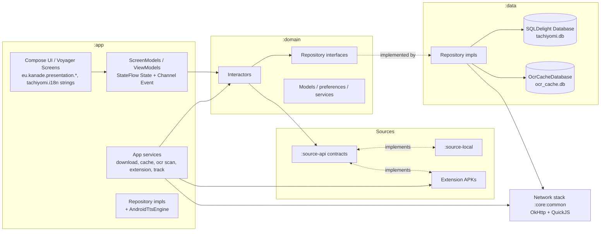

# Yomitsu — Architecture

> Status: living document. Describes HOW the system is built.
> Documents the ACTUAL architecture (Read-Aloud TTS v1 + Phase 10A voice
> config + 2026-09-01 multi-feature set shipped in v0.5.x; latest release v0.5.3).
> WHAT belongs in `docs/prd.md`; rules in `docs/rules.md`; progress in `docs/memory.md`.
> All paths verified against the repository (branch `main`, v0.5.3, versionCode 29;
> re-verified against source by the 2026-09-12 master audit + RM-01).

---

## 1. System overview

Yomitsu is a Gradle multi-module Android app (Kotlin 2.4, Jetpack Compose,
minSdk 26 / targetSdk 36 / compileSdk 37). Layering follows a clean-ish
architecture: **UI (:app presentation) → interactors (:domain) → repositories
(interfaces :domain, impls :data/:app) → sources/network**. DI is **Injekt**
(no Hilt/Koin/Dagger). Navigation is **Voyager** screens + Compose.



### Modules (`settings.gradle.kts`)

| Module | Namespace | Responsibility |
|---|---|---|
| `:app` | `eu.kanade.tachiyomi` | Application: entrypoints (`App.kt`, `ui/main/MainActivity.kt`), all screens, reader, DI wiring (`AppModule`, `PreferenceModule`, `DomainModule`), WorkManager jobs, caches, extension manager, trackers, OCR scan runtime |
| `:domain` | `tachiyomi.domain` (+ `mihon.domain.*`) | Models, repository interfaces, interactors, preference/service classes (`OcrPreferences`, dictionary audio interfaces) — pure Kotlin/Android-free where possible |
| `:data` | `tachiyomi.data` (+ `mihon.data.*`) | Repository implementations; two SQLDelight schemas (`Database`, `OcrCacheDatabase`); OCR engines; panel detection |
| `:source-api` | `eu.kanade.tachiyomi.source` | Source contracts (`HttpSource`, filters, `SManga`/`SChapter`/`Page`) |
| `:source-local` | `tachiyomi.source.local` | Local source: folders/archives/EPUB |
| `:core:common` | `eu.kanade.tachiyomi.core.common` | Network stack (`NetworkHelper`, interceptors, DoH), `PreferenceStore`, storage helpers, QuickJS engine |
| `:core:archive` | `mihon.core.archive` | libarchive-based archive reading |
| `:core-metadata` | `tachiyomi.core.metadata` | Manga metadata/title parsing |
| `:i18n` | `tachiyomi.i18n` | moko-resources strings (base only hand-edited) |
| `:presentation-core` | `tachiyomi.presentation.core` (+ `mihon.presentation.core`) | Shared Compose components (`SettingsItems`, `AdaptiveSheet`, `Pill`, …), i18n helper |
| `:presentation-widget` | `tachiyomi.presentation.widget` | Glance "Upcoming" widget |
| `:telemetry` | `mihon.telemetry` | Firebase wrapper; real/noop source-set swap via `-Pinclude-telemetry` |
| `:baseline-profile` | `mihon.baselineprofile` | Baseline profile generator (GMD pixel6Api34) |

Dependency direction: `:app → everything`; `:data → :domain → :source-api`;
`:presentation-* → :i18n/:core:common`. Never introduce cycles
(see `docs/rules.md`).

---

## 2. Application flow

```text
Process start
  → App.onCreate()                        (app/src/main/java/eu/kanade/tachiyomi/App.kt)
      → patchInjekt(); Injekt.importModule(PreferenceModule) / (AppModule) / (DomainModule)
      → Coil image loader factory (OkHttp client from NetworkHelper)
  → MainActivity (single activity, ui/main/)
      → Voyager Navigator → HomeScreen (tabs: Library, History, Updates, Browse, Feed, More)
  → Library / Browse(source/extension) / History / Updates / Feed / More(settings…)
  → MangaScreen → Chapters → ReaderActivity (explicit Activity, not Voyager)
      → ReaderViewModel.init(manga, chapter)
          → ChapterLoader → page loaders → Viewer rendering
          → OCR early-init; tap-to-lookup / region selection / background scans
          → Read-Aloud TTS on top of cached/scanned OCR results
```

Cross-cutting services started from screens/jobs: `DownloadManager`,
`LibraryUpdateJob`, `OcrScanJob` (WorkManager), `BackupCreatorJob`,
tracking sync, updater (flag-gated).

---

## 3. Reader flow (actual)

Key files:

- `app/src/main/java/eu/kanade/tachiyomi/ui/reader/ReaderActivity.kt`
- `app/src/main/java/eu/kanade/tachiyomi/ui/reader/ReaderViewModel.kt`
- `app/src/main/java/eu/kanade/tachiyomi/ui/reader/viewer/**` (`Viewer` interface,
  `PagerViewer` + L2R/R2L/Vertical, `WebtoonViewer`)
- `app/src/main/java/eu/kanade/tachiyomi/ui/reader/loader/**` (`ChapterLoader`,
  `HttpPageLoader`, `DownloadPageLoader`, `ArchivePageLoader`, `EpubPageLoader`,
  `DirectoryPageLoader`)
- models: `ui/reader/model/{ReaderChapter,ReaderPage,ViewerChapters,ChapterTransition,InsertPage}`

Flow:

1. **Open**: `ReaderActivity.newIntent(manga, chapter)` → `viewModel.init(...)`
   loads manga, builds filtered `chapterList`, creates `ChapterLoader`, eagerly
   initializes the OCR model ("Initialize OCR model early", VM init).
   Also fires the eager TTS engine init job (`ttsEagerInitJob`,
   `ReaderViewModel.init`, overlapping Google TTS service startup with reader
   prep; idempotent fast-path dedups against later Read-Aloud starts).
   Process-death restore via `SavedStateHandle(chapter_id, page_index)`.
2. **Load chapter**: `ChapterLoader.getPageLoader()` picks loader by source type:
   downloaded → `DownloadPageLoader`; LocalSource format → Directory/Archive/Epub;
   else `HttpPageLoader`.
3. **Load pages**: `HttpPageLoader.getPages()` reads the page list from
   **ChapterCache** first, else `source.getPageList()`; image requests go through
   a priority queue (RETRY > DEFAULT > ADJACENT), preload next 4 pages, images
   cached to disk (`ChapterCache`, DiskLruCache 100 MiB).
4. **Display**: `ViewerChapters` wrapped in adapters; `PagerViewer` (ViewPager)
   or `WebtoonViewer` (RecyclerView) render pages via Coil +
   `ReaderPageImageView` (subsampling for tall images). Page changes call
   `activity.onPageSelected(page)` → `ReaderViewModel.onPageSelected` persists
   progress, marks read, tracks, triggers downloads, emits `Event.PageChanged`
   (TTS navigation debounced 250 ms for user swipes; advance confirmations
   land immediately).
5. **Navigation**: toolbar/keyboard `loadNextChapter`/`loadPreviousChapter`;
   adjacent chapters preloaded (`preload`); transitions rendered between chapters;
   dual-page split and InsertPage handled inside pager adapters.
6. **State**: single `MutableStateFlow<State>` in `ReaderViewModel`
   (`@Immutable State`: manga, viewerChapters, currentPage, dialog, menuVisible,
   ocrSelectionMode, isProcessingOcr, brightnessOverlayValue, …).
7. **VM→Activity events**: `Channel<Event>` exposed as `eventFlow`, collected in
   `ReaderActivity.onCreate` (~l.326): ReloadViewerChapters, PageChanged,
   SetOrientation, SetCoverResult, SavedImage/ShareImage/CopyImage, Ocr* errors.
8. **Lifecycle**: viewers destroyed in `onDestroy`; `ReaderViewModel.onCleared()`
   calls `OcrRepository.cleanup()` / `PanelDetectionRepository.cleanup()`.
    Compose overlays rendered via `binding.setComposeOverlay()` +
    `ContentOverlay(...)` (app bars, OCR selection overlay, dialogs,
    `OcrLoadingIndicator` at BottomCenter).

### 3.1 Chapter-transition prefetch pipeline (shipped 2026-09-20, verified)

- **N+1 image prefetch**: at N's `loadChapter` success,
  `ReaderViewModel.maybePrefetchNextChapter` fires a best-effort job on
  `viewModelScope`/IO: guards = `ReaderPreferences.prefetchNextChapter`
  (default true) + `nextChapter != null` + source is `HttpSource` + NOT
  `TRANSPORT_CELLULAR` + one-shot `NextChapterPrefetchGate` per active
  chapter id. Job = `loader.loadChapter(next)` (page-list fetch) +
  `loader.prefetchFirstPages(next)` (p0..p3; `HttpPageLoader.preloadNextPages`
  auto-enqueues ADJACENT p1..p4). Runs on N+1's own `HttpPageLoader` queue
  (per-chapter `PriorityBlockingQueue` + dedicated coroutine scope) so N's
  active loads/TTS are never preempted in-thread. Cancel points:
  `loadNewChapter` + `onCleared`. Eviction: N+1 prefetch writes 4 images into
  the 100 MiB `DiskLruCache`, evicting ~5–10 oldest N images (safe,
  refetchable). Local/downloaded chapters no-op; cellular short-circuits.
- **Reader-open OCR prefetch**: `maybePrefetchReaderOpenOcr(0)` inside
  `loadNewChapter` (NORMAL priority, one-shot `ReaderOpenPrefetchGate` keyed
  by active chapter id) starts a p0 scan early so GLENS work overlaps reader
  dwell time; later TTS acquisition joins the in-flight scan or hits the
  cache. Skipped while a TTS session is active (its own prefetch covers
  these pages) — that skip is deliberate for the ACTIVE chapter; N+1 is the
  uncovered case (see §4.3 for the gap analysis).
- TTS lookahead prefetch of p1..pN+depth (rate-aware depth 2–3) is inside
  `TtsPlaybackController.schedulePrefetch`; OCR scans run through
  `PrioritizedTaskQueue` (cap 3; HIGH = active-page on-demand, NORMAL =
  all prefetch/background).

    > Historical note (RESOLVED): an earlier memory.md entry (Known-issue #2)
    > warned about a second, parallel `setComposeContent` composition block
    > inside ContentOverlay, requiring TTS bar additions to target the inner
    > block. The 2026-09-12 master audit verified ReaderActivity has exactly
    > ONE composition block (`setComposeOverlay` in ReaderActivity.kt:606);
    > the dual-block landmine no longer exists. Reader overlays compose in a
    > single tree; the inline z-order contract is codified as a comment at
    > the Box in ReaderActivity's overlay composition.

---

## 4. OCR flow (actual)

Engines live in `data/src/main/java/mihon/data/ocr/`; contracts/models in
`domain/src/main/java/mihon/domain/ocr/`.

```text
Entry points
  A. Tap-to-lookup     : cached OcrPageResult hit-test → Dialog.OcrResult
  B. Region selection  : bottom-bar button or long-press → drag rect
                          → viewer.resolveSelectionCaptures → ReaderSelectionCropper
                          → OcrProcessor.getText(bitmap.toOcrImage())
                          → flattenOcrTextForQuery → dictionary search
  C. Background scan   : OcrScanManager queue → OcrScanJob (WorkManager)
                          → OcrChapterScanner (per page: resolve bitmap → ScanPageOcr)
  D. Exclusion zones    : drag-select → SaveExclusionZone → scope dialog
                          (PAGE pure zone; CHAPTER/MANGA/SOURCE optional text
                          → COMBINED) → ocr_exclusion_zones table → applied at
                          TTS speech-acquisition time only (tap/dictionary OCR
                          intentionally unaffected)
  E. Read-aloud TTS    : GetCachedPageOcr / ScanPageOcr per page → speech
                          pipeline → segmenter → speech

Engine pipeline (repository-serialized)
  OcrRepositoryImpl.scanPage(model, …)
    → engineFor(model): Legacy(LiteRT local) | Fast(TFLite local)
                        | Glens(HTTP) | OwOcr(WebSocket self-hosted)
    → fallback chain if enabled (GLENS↔FAST, LEGACY→GLENS, OWOCR→GLENS)
    → PrioritizedTaskQueue + OcrEngineLocks serialize all engine work
    → TextPostprocessor normalizes lines (whitespace collapse, …→"...", half→full width)
    → OcrCacheStore.upsert(page + regions)
```

Result representation (`domain/.../mihon/domain/ocr/model/OcrModels.kt`):

- `OcrRegion(order: Int, text: String, boundingBox: OcrBoundingBox, textOrientation)`
  — bounding boxes are normalized floats; orientation ∈ {Horizontal, Vertical}.
- `OcrPageResult(chapterId, pageIndex, ocrModel, imageWidth, imageHeight, regions)`
  with computed flattened `text`.

### 4.3 OCR execution strategy: hybrid local-first dual-stage pipeline (audit 2026-09-25, NOT shipped)

Verdict from `docs/audits/ocr-prefetch-latency-audit-report.md` §5: the
residual N→N+1 transition latency is dominated by GLENS service round-trip
(median ~9.6s / p90 ~17.9s post-upload wait, device-measured 2026-09-19
Stage 4M). Client-side scheduling (image prefetch + reader-open OCR
prefetch, both shipped) hides everything else; the only structural
levers left:

- **Stage 1 (local FAST first-pass, <100ms)**: `FastOcrEngine.recognizeText`
  (full-page TFLite inference, `ocr_fast/encoder+decoder.tflite`) yields
  one region-less text blob for interim TTS start. CONDITIONAL: conflicts
  with the shipped "local OCR engine reinstatement REJECTED" decision
  (roadmap §F) — requires explicit user scope authorization + asset
  repackaging (ocr_fast tflites back into release assets; legacy
  assets/ocr/ removal saved −133MB in v0.5.4). JP-vocab model: English
  manga text quality will be poor (interim only, never authoritative).
- **Stage 2 (background GLENS upgrade)**: GLENS scan of N+1 runs in the
  background at reader open / via the `OcrScanManager` service (same path
  as the "Scan Next Chapter" FAB), upserting `OcrCacheStore` rows under
  `ocr_model=GLENS`; TTS cache reads are model-pinned, so FAST interim
  text and GLENS authoritative text coexist without clobbering. No
  mid-session retro-re-speak — upgrade applies to later page acquisitions
  only.
- **Supporting changes (roadmap §E new tasks S1–S5)**: `PrioritizedTaskQueue`
  +LOW tier; N+1 background OCR prefetch job in `ReaderViewModel` (shared
  cellular guard + uncached-check + TTS-auto-next-chapter gate);
  `applyVoiceConfig` skip-on-unchanged-prefs (~250ms/resume); GLENS
  `HttpURLConnection` → shared OkHttp keep-alive pool (kills 4.9s
  first-batch handshake p90; raw-connection path `GlensOcrEngine.kt:359-417`
  currently `disconnect()`s per tile). None authorized/shipped yet.
- **FAB automation (audit §7)**: recommended hook = reader-entry
  auto-enqueue of the next-unread chapter id through
  `OcrScanManager.enqueue` (~15 lines in `ReaderViewModel`, reuses the
  `OcrScanJob` service path: progress UI, per-page resilience, network
  checks in `OcrChapterScanner.kt:223-235`). Queue is idempotent
  (dedupe by chapter id), so the manual FAB stays as a harmless override.
  Not implemented — needs authorization.

Ordering rules & caveats (important for TTS):

- GLENS orders vertical bubbles right→left/top→bottom then horizontal top→bottom
  and strips furigana geometrically (`GlensOcrEngine.filterRuby`). OWOCR derives
  orientation from `writing_direction`.
- The local detect+recognize path (`scanLocally`) uses raw detection index as
  `order` with hardcoded Horizontal orientation; its detection engine stub
  always throws (`UnavailableDetOcrEngine`) so it redirects to Glens when
  fallbacks are enabled. Since 2026-09-03 `recognizeText` (crop/selection OCR)
  applies the same LEGACY/FAST→GLENS redirect — the JP-vocab Legacy model no
  longer runs on arbitrary English crops (`ponytail:` note marks the drop
  point when a real `DetOcrEngine` lands). **Known gap**: local scans still
  lack Glens-style ordering — do not silently re-order; document instead
  (see prd.md §Future).
- Cache returns regions sorted by `region_order`; latest model wins per page.

Error handling: `OcrException` hierarchy (InitializationError, ConnectionError,
DetectionUnavailable); reader maps outcomes to `Event.OcrNoTextFound /
OcrMemoryError / OcrInitializationError / OcrError` → toasts.

### 4.1 OCR exclusion system (actual, shipped v0.5.2)

Single table `ocr_exclusion_zones` (migrations `18.sqm` create + `19.sqm`
rebuild; `data/src/main/sqldelight/tachiyomi/data/ocr_exclusion_zones.sq`):
`manga_id` (0 = global text rule), `source_id`, `chapter_id` (NULL for
MANGA/SOURCE rules — no cascade), `page_index`, `scope`
(PAGE/CHAPTER/MANGA/SOURCE), normalized rect, `enabled`, `match_type`
(ZONE/WORD/PHRASE/COMBINED), `match_text`, `rule_name`.

- **ZONE**: pure-rect, page-anchored for ALL scopes (own chapterId for
  PAGE/CHAPTER, mangaId/sourceId for MANGA/SOURCE); legacy rows with NULL
  `page_index` are DORMANT (visible + deletable, never matched).
- **WORD**: global standalone-token run match — NFKC-normalized, case-folded,
  rule tokens concatenated must equal a consecutive run of region tokens
  ("K-manga.com" ≡ [k,manga,com]; "KeyManga" ≡ "Key Manga"; "ion" ≠
  "combination").
- **PHRASE**: NFKC-fold + lowercase + whitespace-stripped substring, with
  token-concat containment fallback — separator/punctuation tolerant both
  directions ("discord gg" matches "discord.gg").
- **COMBINED**: opt-in only (non-blank match text on save); rect overlap AND
  phrase match within scope.
- Matching is per-region (phrases split across two regions are NOT excluded —
  documented v1 semantics); applied in `TtsPlaybackController.acquireSentences`
  via `awaitForSpeech` (rules re-queried per page, so mid-session adds apply
  next page). Pure matcher: `OcrExclusionMatcher` + `ExclusionMatchContext`
  (`:domain`), 35 unit cases.
- UI: reader drag-select save flow (`OcrExclusionZoneDialogs`), manga-scoped
  manage sheet, full Settings screen (`SettingsOcrExclusionsScreen`,
  `Destination.OcrExclusions` id 5) with per-rule edit (words/phrases,
  `updateMatchText`), identity labels, expand/collapse, legacy markers.
- Backup/restore: `BackupOcrExclusionZone` proto (additive, old backups
  decode); restorer dedupes and skips invalid scopes/matchTypes.
- Zone creation rejects pages where displayed dims ≠ original image dims
  (dual-page split / rotateToFit) — honest error beats silently-wrong rect.

ML model assets are gitignored and absent from fresh clones
(`app/src/main/assets/ocr/*`, `app/src/main/assets/ocr_fast/*`,
`data/src/main/assets/panel_detector/model.tflite`); CI downloads them with
pinned sha256 (`.github/workflows/build.yml`).

---

## 5. TTS flow (actual — v1 shipped + Phase 10A + 2026-09 hardening)

```text
[▶ tapped] → ReaderViewModel.startTts()
  → TtsPlaybackController.start()                    (viewModelScope, :app)
      ├─ AndroidTtsEngine.initialize()               (main thread, CompletableDeferred bridge)
      ├─ voice config re-applied from FRESH prefs on every initialize
      ├─ requestAudioFocus(AUDIOFOCUS_GAIN)
      └─ per page N:
           1. TEXT     GetCachedPageOcr.await(chapterId, N)         ← ocr_cache.db
                         miss → OcrPageSourceResolver.resolve(...)
                                  → openBitmap → ScanPageOcr (persists) → recycle bitmap
           2. SPEECH   SpeechPipeline.toSpeakableSentences(regions)   (pure, :domain)
                         dedupeOverlappingDuplicates (text+IoU overlap)
                         → classify (SpeechRegionClassifier)
                         → filter (SpeechRegionFilterConfig)
                         → clean (SpeechCleaner, post-NFKC)
                         → exclusions (OcrExclusionMatcher, speed-aware)
                         → SentenceSegmenter.toTtsSentences()
           3. SPEAK    engine.speak("pN-sI-c{dispatch}", sentence.text) (suspends until done/error)
           4. ADVANCE  TtsAdvancePolicy.computeAdvance(...)           (pure, :domain)
                         NextPage    → Event.TtsAdvancePage(N+1) → activity.moveToPageIndex
                         NextChapter → Event.TtsAdvanceChapter  → activity.loadNextChapter
                         Finish      → state=Finished, abandon focus
           [prefetch] sequential prefetch of up to 3 pages ahead (depth
                       speed-aware: 1 @ <1.5x, 2 @ 1.5–2.5x, 3 @ ≥2.5x;
                       mid-page escalation at sentenceIndex == size/2 when
                       rate ≥ 2x); cancelled on any page change
```

Layering (extensible for future engines):

```text
Reader UI (Compose bar)            :app  eu.kanade.presentation.reader.TtsPlaybackBar
ReaderViewModel                    :app  ui/reader/ReaderViewModel (ttsState in State)
TtsPlaybackController              :app  ui/reader/tts/  (orchestration only)
TtsEngine interface                :domain mihon/domain/tts/engine/TtsEngine.kt
SentenceSegmenter / AdvancePolicy  :domain mihon/domain/tts/       (pure, unit-tested)
Speech pipeline (clean/classify/   :domain mihon/domain/tts/speech/ (pure, unit-tested)
  filter/dedup + geometry helpers)
TtsPreferences                     :domain mihon/domain/tts/service/TtsPreferences.kt
TtsVoicePreferences + selection    :domain mihon/domain/tts/service/TtsVoicePreferences.kt
TtsVoiceProfile model              :domain mihon/domain/tts/service/ (JSON pref list)
AndroidTtsEngine                   :app  data/tts/AndroidTtsEngine.kt
  └─ android.speech.tts.TextToSpeech + AudioManager/AudioFocusRequest (framework)
Read-aloud settings screen/model   :app  ui/setting/readaloud + presentation settings screen
future: CloudTtsEngine / NeuralTtsEngine implement TtsEngine without touching reader
```

Phase 10A additions to `TtsEngine` (voice configuration contracts, shipped):

- `suspend getEngines(): List<TtsEngineInfo>` — installed engines
  (`packageName`, `label`, `isSystemDefault`); empty when uninitialized.
- `suspend getVoices(): List<TtsVoiceInfo>` — voices of the ACTIVE engine
  (`name`, `languageTag`, `displayName`, `quality`, `latency`, `features`,
  `networkRequired`); empty when uninitialized.
- `setEnginePackage(pkg: String)` — engine for the NEXT `initialize`; "" =
  system default. If currently initialized with a different package, the
  implementation releases the instance so the next initialize rebuilds.

`AndroidTtsEngine` config pipeline (Phase 10A, shipped):

- Construction seeds `enginePackage` / `voiceName` / `languageTag` fields from
  `TtsVoicePreferences`; `activeEnginePackage` snapshots the package a live
  instance was actually built with. Engine creation is engine-package-aware
  (3-arg `TextToSpeech(context, listener, pkg)` when pinned, 2-arg otherwise).
- `setEnginePackage` compares against `activeEnginePackage` and `shutdown()`s
  on mismatch → next `initialize()` rebuilds with the new engine. (It does
  NOT re-read the engine pref inside applyVoiceConfig — that would mask the
  mismatch; `activeEnginePackage` is the comparison source of truth.)
- `initialize()` idempotent path re-applies voice config from FRESH prefs on
  every call. The controller already calls `initialize()` on resume and each
  playback step, so mid-session preference changes are picked up with ZERO
  controller/ReaderViewModel changes.
- `applyVoiceConfig` uses pure `resolveVoiceSelection` fallback:
  Voice → `setVoice` (unavailable voice → DEBUG log, default stays);
  Language → `setLanguage` (`LANG_MISSING_DATA`/`LANG_NOT_SUPPORTED` → DEBUG
  log, default stays); SystemDefault → restore `engine.defaultVoice` (null →
  DEBUG log, leave as-is). Voice/locale apply failures NEVER fail initialize.
- `getEngines`/`getVoices` run on the Main context; return empty lists when
  uninitialized. Speak/stop/shutdown/focus paths unchanged from Phase 9.

#### 5.4 TTS engine warm lifecycle (device-measured, 2026-09-19/20 Stage 2D/4N)

- **Cold start** = `TextToSpeech` ctor + `readiness.await()` onInit callback:
  ~5.4s genuine Google TTS service latency (device-measured, irreducible
  client-side; one 28.9s anomalous boot observed, not an app bug).
- **Warm reuse** (engine instance alive) = `applyVoiceConfig` fast path:
  ~81ms measured. **Known overhead**: the warm path re-enumerates
  `engine.voices` + `engine.engines` (~66/227 entries) and re-applies
  `setVoice` even when prefs are unchanged — ~250–305ms on every
  resume/reuse (audit RC-5; proposed fix S3 = skip re-apply when
  `(enginePackage, voiceName, languageTag)` unchanged). Not first-speech
  path.
- **Eager init**: `ReaderViewModel.init` fires `ttsEagerInitJob`
  (`ttsEngine.initialize()`, no focus/no speech, async) so the 5.4s cold
  start overlaps reader prep — first Read-Aloud tap then hits the 81ms warm
  path (Stage 2D: 43s pre-tap → 81ms reuse measured). `onCleared()`
  detaches `onFocusEvent` + calls `ttsEngine.shutdown()` (no FGS; reader-
  bound playback by durable decision #2).

Preview policy (single shared engine): the read-aloud settings preview and
reader narration use the same `AndroidTtsEngine` singleton; preview calls
`stop()` → `initialize()` → rate/pitch → `acquireFocus()` → `speak(sample)`;
reader narration speaks with `QUEUE_FLUSH` and always wins; interrupted
narration pauses honestly via the existing controller.

### 5.1 Speech pipeline (2026-09-01 Phases A–C, shipped v0.5.2)

Pure chain in `mihon.domain.tts.speech` (`SpeechPipeline.toSpeakableSentences`),
applied ONLY to speech — original OCR regions stay immutable (dictionary/
tap-overlay/search see full text):

1. `dedupeOverlappingDuplicates` — drops later regions whose normalized text
   exactly duplicates an earlier kept region AND strictly overlaps its bbox;
   duplicate text in disjoint bubbles survives (cross-tile seam duplicates).
2. `SpeechRegionClassifier` heuristics → DIALOGUE / SOUND_EFFECT /
   EXPRESSION / NARRATION / DECORATIVE (blank, symbol-only, foreign script on
   page-script mismatch, wide-thin terminal-less). Designed for future
   metadata swap-in (`OcrRegion` untouched).
3. `SpeechRegionFilter` — per-type speak toggles (sfx/expressions default
   off), foreign-script skip (script-based LATIN/CJK hint, multilingual).
4. `SpeechCleaner` — punctuation-only skip (post-normalization so emphatic
   dialogue survives), conservative OCR-garbage detector, excessive-punct
   run normalization, whitespace collapse, ellipsis→pause.
5. `SentenceSegmenter` — unchanged terminal-punct rules (below).

Cleanup runs BEFORE segmentation (punct runs normalize first);
post-segment punctuation-only slices dropped. Prefs in `TtsPreferences`
(`pref_tts_skip_punctuation_only`, `pref_tts_skip_ocr_garbage`,
`pref_tts_normalize_punctuation`, `pref_tts_ellipsis_to_pause`,
`pref_tts_speak_sfx`, `pref_tts_speak_expressions`,
`pref_tts_skip_foreign_script`, `pref_tts_speech_script`) — all backed up.

Tests: `SpeechCleanerTest` (11), `SpeechPipelineDedupTest` (9),
`SpeechRegionClassifierTest` (7), `SpeechRegionFilterTest` (9),
`BoxMostlyInsideTest` (7), `SentenceSegmenterTest` (15),
`TtsAdvancePolicyTest` (10), `OcrExclusionMatcherTest` (35),
`TtsVoicePreferencesTest` (5).

### 5.2 Voice profiles (2026-09-01 Phase E, shipped v0.5.2)

`TtsVoiceProfile` (`@Serializable`: id, name, enginePackage, voiceName,
languageTag, rate, pitch) stored as JSON in one pref (`pref_tts_voice_profiles`)
+ active id pref. `ReadAloudSettingsScreenModel` exposes save/delete/apply
(apply writes component prefs + rate/pitch + `setEnginePackage` + reload).
UI: "Voice profiles" group in `SettingsReadAloudScreen`.

### 5.3 Speech rate 50–300% (Phase F, shipped)

Rate slider 50..300 in both reader tab and main settings; engine-side no
clamp. `TtsPlaybackBar` shows a video-player-style speed chip + dropdown
(0.5–3x) writing the shared rate pref; controller's live collector applies
to the engine mid-session.

Future-provider extensibility: cloud/neural engines are new `TtsEngine`
implementations bound by an Injekt factory swap in `DomainModule`; playback
controller and reader stay untouched.

Design rules (binding):

- Ordering: consume regions in stored order; never re-sort in the segmenter.
- Segmentation never merges across regions; terminal punct `。！？!?‼⁇⁉⁈` only
  (plus English rules: ASCII `.` terminal only before whitespace/EOL,
  dot-runs glued, decimals safe).
- Controller never touches `Viewer` directly — advances go through existing
  `Event`s handled by `ReaderActivity.moveToPageIndex/loadNextChapter`;
  user swipes mid-playback win (rebuild queue for new page).
- Threading: all `TextToSpeech` calls on main (needs Looper); IO for bitmaps/DB;
  controller body in `viewModelScope`; no bitmaps across suspension points
  outside an acquire/finally-recycle block.
- Lifecycle matrix (pause on onStop, continue through rotation, shutdown on
  finish/onCleared, audio-focus handling) — see prd.md §F6 and root architect.md.
- No new caching layer in v1; no foreground service/MediaSession/permissions.
- Duplicate-speech hardening (2026-09-01, shipped): per-dispatch monotonic
  utterance ids (`p{n}_s{i}_c{dispatch}`), identity-checked pending-callback
  removal, `resume()` calls `engine.stop()` after job cancel (zombie flush),
  resumeIndex set to next sentence before suspension points, page-sentence
  overflow advances instead of resetting.
- Webtoon hardening (shipped): region-level auto-scroll via
  `TtsEvent.ScrollToRegion`, advance-confirm via
  `findFirstVisibleItemPosition`, pause/resume page-awareness.

---

## 6. Folder structure (actual)

```text
yomitsu/
├── app/                                # :app — application module
│   └── src/main/java/
│       ├── eu/kanade/tachiyomi/
│       │   ├── App.kt                  # Application: Injekt bootstrap, Coil factory
│       │   ├── di/                     # AppModule, PreferenceModule (Injekt)
│       │   ├── ui/                     # Voyager screens: main/, home/, library/, history/,
│       │   │                           #   updates/, browse/, feed/, more/, reader/, download/,
│       │   │                           #   setting/ (incl. readaloud/, ocrexclusions/),
│       │   │                           #   dictionary/ (DictionaryLookupScreen), manga/, migration/…
│       │   │   └── reader/             # ReaderActivity, ReaderViewModel, viewer/, loader/,
│       │   │                           #   model/, setting/, tts/ (TtsPlaybackController)
│       │   ├── data/                   # cache/(ChapterCache,CoverCache), download/, backup/,
│       │   │                           #   ocr/(OcrScanJob,OcrScanManager,OcrChapterScanner),
│       │   │                           #   tts/(AndroidTtsEngine), dictionary/(audio import jobs),
│       │   │                           #   coil/, track/, saver/
│       │   ├── extension/              # ExtensionManager, ExtensionLoader, installers
│       │   └── network/                # TrustedFileDownloader (stack itself in :core:common)
│       ├── eu/kanade/domain/           # DomainModule.kt (Injekt repos+interactors),
│       │                               #   dictionary/DictionaryPreferences
│       ├── eu/kanade/presentation/     # Compose UI per feature incl. theme/, reader/,
│       │                               #   feed/ (FeedScreen, ManageFeedsScreen), library/
│       └── mihon/                      # core/designsystem, core/migration, feature/{migration,ocr,…}
├── domain/src/main/java/
│   ├── tachiyomi/domain/               # category/chapter/history/library/manga/release/
│   │                                   #   source/track/updates/storage/download/backup services
│   └── mihon/domain/                   # ocr/ (model, repository, interactor, exclusion
│                                       #   zones+matcher, service/OcrPreferences), tts/
│                                       #   (engine, speech pipeline, segmenter, policy,
│                                       #   prefs, voice profiles), dictionary/ (models,
│                                       #   parser, audio/), ankidroid/, panel/, extension/,
│                                       #   upcoming/, feed/
├── data/src/main/
│   ├── java/mihon/data/ocr/            # OcrRepositoryImpl, engines, TextPostprocessor,
│   │                                   #   PrioritizedTaskQueue, OcrEngineLocks, OcrCacheStore,
│   │                                   #   OcrExclusionZoneRepositoryImpl
│   ├── java/tachiyomi/data/            # repository impls, DatabaseAdapter
│   ├── sqldelight/tachiyomi/           # main .sq files + migrations/1..19.sqm
│   └── sqldelight-ocr/tachiyomi/data/ocr/ocr_cache.sq
├── source-api/src/                     # commonMain eu.kanade.tachiyomi.source contracts
├── source-local/src/                   # expect/actual LocalSource
├── core/common/src/main/kotlin/        # network/, preference/, storage/, util/
├── core/archive/                       # libarchive wrapper
├── core-metadata/                      # metadata parsing
├── i18n/src/commonMain/moko-resources/base/strings.xml   # ONLY editable locale
├── presentation-core/src/main/java/    # shared Compose components + i18n helper
├── presentation-widget/                # Glance widget
├── telemetry/                          # firebase/noop source sets
├── baseline-profile/                   # GMD baseline generator
├── gradle/build-logic/                 # included build: convention plugins (PluginAndroidBase,
│                                       #   PluginSpotless, …) + mihon.versions.toml catalog
└── docs/                               # THIS documentation system
```

---

## 7. File responsibilities (TTS/speech-related)

### Existing files being reused (no duplication)

| File | Reuse |
|---|---|
| `domain/.../mihon/domain/ocr/interactor/GetCachedPageOcr.kt` | Cached text source |
| `domain/.../mihon/domain/ocr/interactor/ScanPageOcr.kt` + `WithOcrScanSession.kt` | On-demand scan + session accounting |
| `app/.../data/ocr/OcrPageSourceResolver.kt` (+ Gateway/BitmapDecoder) | Bitmap acquisition for uncached pages |
| `domain/.../mihon/domain/ocr/model/OcrModels.kt` | `OcrRegion` input to segmentation; normalization fns |
| `data/.../mihon/data/ocr/TextPostprocessor.kt` | Already-normalized region text |
| `app/.../ui/reader/ReaderViewModel.kt` | Host controller; `State.ttsState`; event emission |
| `app/.../ui/reader/ReaderActivity.kt` | Event handling (`moveToPageIndex`, `loadNextChapter`), overlay composition, exclusion-zone capture |
| `app/.../di/AppModule.kt`-style modules (`DomainModule.kt`, `di/PreferenceModule.kt`) | DI registration points |
| `domain/.../mihon/domain/dictionary/audio/DictionaryAudioPlayer.kt` | Interface-in-domain precedent (pattern only; left untouched) |

### TTS/speech feature files (all shipped; v1 + 10A + 2026-09 sets)

| File | Responsibility |
|---|---|
| `domain/.../mihon/domain/tts/engine/TtsEngine.kt` | Framework-free engine contract: initialize, getEngines/getVoices/setEnginePackage, suspend speak, rate/pitch, focus hooks, stop, shutdown |
| `domain/.../mihon/domain/tts/SentenceSegmenter.kt` | Pure `List<OcrRegion>.toTtsSentences()` (region-boundary-respecting split, EN+JP terminal rules) |
| `domain/.../mihon/domain/tts/TtsAdvancePolicy.kt` | Pure advance decision function (NextPage/NextChapter/Finish/PauseAtPageEnd) |
| `domain/.../mihon/domain/tts/speech/SpeechPipeline.kt` | Pure speech prep chain: dedup (text+IoU) → classify → filter → clean → segment; geometry helpers (`boxesOverlap`, `boxMostlyInside`, `boundingBoxIoU`) |
| `domain/.../mihon/domain/tts/speech/SpeechCleaner.kt` | Punct-only skip, OCR-garbage detector, punct-run normalization, whitespace collapse |
| `domain/.../mihon/domain/tts/speech/SpeechRegionClassifier.kt` | Heuristic region classification (DIALOGUE/SFX/EXPRESSION/NARRATION/DECORATIVE) |
| `domain/.../mihon/domain/tts/speech/SpeechRegionFilter.kt` | Per-type speak toggles + foreign-script skip (script-based) |
| `domain/.../mihon/domain/tts/service/TtsPreferences.kt` | rate, pitch, auto page turn, auto next chapter, keep-screen-on, speech-cleanup + classification prefs |
| `domain/.../mihon/domain/tts/service/TtsVoicePreferences.kt` | engine/voice/language string prefs + `reset()`; sealed `TtsVoiceSelection` + pure `resolveVoiceSelection`; `TtsVoiceProfile` model |
| `domain/.../mihon/domain/ocr/…` (exclusion) | `OcrExclusionZone`, `OcrExclusionScope`, `OcrExclusionMatcher` (pure), interactors (Get/Add/Delete/SetEnabled/UpdateText/subscribe) |
| `app/.../data/tts/AndroidTtsEngine.kt` | `TextToSpeech` + audio focus implementation of `TtsEngine`; engine-package-aware creation, initialize-time config re-apply |
| `app/.../ui/reader/tts/TtsPlaybackController.kt` | Orchestration: text→speech→speak→advance loop, exclusions at acquire, speed-aware prefetch, arbitration, action logging |
| `app/.../presentation/reader/TtsPlaybackBar.kt` | Floating playback pill (speed chip + dropdown, prev/play-pause/next/stop, sentence text, position, retry) |
| `app/.../presentation/reader/settings/ReadAloudPage.kt` | Reader quick-settings tab (rate slider, toggles, deep-link row) |
| `app/.../ui/setting/readaloud/ReadAloudSettingsScreenModel.kt` | StateScreenModel: engine init, pickers, preview, reset, voice profiles |
| `app/.../presentation/more/settings/screen/SettingsReadAloudScreen.kt` | "Read aloud & voice" screen: engine/language/locale/voice pickers (voice searchable), calibration, preview, profiles, advanced |
| `app/.../presentation/more/settings/screen/SettingsOcrExclusionsScreen.kt` + `ui/setting/ocrexclusions/` | OCR exclusion rules management screen (words/phrases/zones, edit, toggle, delete) |
| `app/.../presentation/feed/FeedScreen.kt` + `ManageFeedsScreen.kt`, `ui/feed/{FeedTab,FeedScreenModel}.kt` | Feed tab: multi-source popular/latest grid, filter chips; central feed management screen |
| `app/.../ui/dictionary/DictionaryLookupScreen.kt` | Standalone dictionary lookup screen (More tab entry) |

Modified integration points: `DomainModule.kt` (engine/exclusion bindings),
`PreferenceModule.kt` (TTS + voice prefs), `ReaderViewModel.kt` (controller
host, `ttsState`, Events, exclusion save/detect), `ReaderActivity.kt` (event
branches, bar rendering, onStop pause, keep-screen-on, zone capture),
`ReaderSettingsDialog.kt` (Read aloud tab + deep-link), `ReaderBottomBar.kt`
(entry icon), `HomeScreen.kt` (Tab.Feed), `MoreScreen.kt` (Dictionary row +
GroupHeader sections), `SettingsMainScreen.kt` (Read aloud & voice + OCR
exclusions rows), `SettingsScreen.kt` (`Destination.ReadAloud` id 4 +
`Destination.OcrExclusions` id 5), `MainActivity.kt`
(`SHORTCUT_VOICE_SETTINGS`), `SettingsSearchScreen.kt` (registration),
`NavigationBar.kt` (presentation-core, floating pill nav),
`ocr_exclusion_zones.sq` + `18.sqm`/`19.sqm`, i18n base strings (TTS +
exclusion + feed keys), backup models/creators/restorers (exclusion zones,
new prefs auto-included).

---

## 8. Data flow

```text
UI (Compose) ──collect──> ScreenModel/ViewModel State (StateFlow, @Immutable data classes)
UI events ──calls──> ViewModel methods ──await──> Interactors (:domain)
Interactors ──await──> Repository interfaces (:domain) ──impl──> :data (SQLDelight) / :app services
Reader: Viewer callbacks → ReaderActivity → ReaderViewModel (state + Channel<Event> back)
OCR:    reader/scan-manager → ScanPageOcr → OcrRepositoryImpl → engine → OcrCacheStore (ocr_cache.db)
TTS:    settings (TtsPreferences Flow) → controller params; controller → ttsState → UI bar
        controller → Events → ReaderActivity navigation APIs → Viewer movement
```

## 9. State management

- Viewers/ScreenModels extend Voyager `StateScreenModel<State>`:
  single `MutableStateFlow<State>`, immutable `State` data classes updated via
  `mutableState.update { copy(...) }`; UI collects as Compose state
  (`collectAsState`-style helpers).
- One-shot VM→UI communication uses `Channel<Event>` + `receiveAsFlow()`
  (reader) or screen-model `Event` channels (dictionary search).
- Preferences expose `Preference<T>` with `changes()` Flows
  (`AndroidPreferenceStore` over SharedPreferences).
- No Redux/MVI framework — the pattern above IS the convention.

## 10. Concurrency

- Kotlin coroutines everywhere (`kotlinx-coroutines 1.11.0`); scopes:
  `viewModelScope`/screen-model scope, `Dispatchers.IO` for disk/network,
  main dispatcher for UI and `TextToSpeech` (needs Looper).
- Flows for streams (preference changes, queue states, DB queries via paging);
  `Channel` for one-shot events; `CompletableDeferred` to bridge callback APIs
  (existing precedent: `PrioritizedTaskQueue.submit`).
- Background work: WorkManager (`CoroutineWorker`) for library updates, downloads,
  OCR scanning, backups, updater.
- Serialization precedents: `PrioritizedTaskQueue` (HIGH/NORMAL FIFO) +
  `OcrEngineLocks` mutexes around OCR engines — reuse, don't add parallel locks.

## 11. Dependency architecture (DI = Injekt)

- Bootstrap: `App.onCreate()` imports exactly three modules:
  - `eu.kanade.tachiyomi.di.PreferenceModule` — `PreferenceStore` + all pref classes
  - `eu.kanade.tachiyomi.di.AppModule` — Application, SqlDriver/Database, Json/XML/ProtoBuf,
    ChapterCache/CoverCache, NetworkHelper, JavaScriptEngine, SourceManager,
    ExtensionManager, Download*, TrackerManager, ImageSaver…
  - `eu.kanade.domain.DomainModule` — repository impl bindings + interactor factories
    (OCR + exclusion-zone bindings incl. `TtsEngine` factory; `DictionaryAudioPlayerImpl`)
- Registration style: `addSingleton(app)`, `addSingletonFactory<T> { … }` (lazy),
  `addFactory { … }` (interactors), `addSingleton<Interface> { get<Impl>() }`.
- Injection: constructor params resolved by Injekt; `Injekt.get<T>()` /
  `injectLazy()` at edges (activities, application).
- TTS bindings (shipped): `addSingletonFactory<TtsEngine> { AndroidTtsEngine(get<Application>()) }`
  in DomainModule + `addSingletonFactory { TtsPreferences(get()) }` /
  `{ TtsVoicePreferences(get()) }` in PreferenceModule.

## 12. Storage

| Store | Tech | Location/notes |
|---|---|---|
| Main DB | SQLDelight `Database` (`tachiyomi.db`, androidx sqlite driver, FK on) | mangas, chapters, categories, history, manga_sync, sources, extension_store, saved_search, excluded_scanlators, ocr_exclusion_zones, 7 dictionary tables; views: libraryView/historyView/updatesView; migrations `1.sqm…19.sqm` (18–19: OCR exclusion zones + rule-model rebuild) |
| OCR cache DB | SQLDelight `OcrCacheDatabase` (`ocr_cache.db`) | `ocr_pages` + `ocr_regions`; latest-model-wins; schema-outdated file deletion instead of .sqm |
| Preferences | SharedPreferences via `PreferenceStore` | default shared prefs; Flow-exposing wrappers |
| Chapter cache | DiskLruCache 100 MiB | `cacheDir/chapter_disk_cache` (page lists JSON + images) |
| Covers | files | `cacheDir/covers[/custom]` |
| Coil | memory cache configured; default disk cache | `App.newImageLoader` |
| Network cache | OkHttp Cache 5 MiB | `cacheDir/network_cache` |
| Downloads/local/backup | SAF via UniFile | `<base>/downloads|local|autobackup` + `.nomedia` (`StorageManager`, `DownloadProvider`) |
| Dictionary audio cache | files SHA-256-keyed | `cacheDir/dictionary_audio` |

Schema-change protocol: new `.sqm` migration + `./gradlew verifySqlDelightMigration`
(main DB). OCR cache DB has its own lightweight scheme — see `docs/rules.md`.

## 13. Networking

- Single shared OkHttp client in `NetworkHelper` (`:core:common`):
  cookie jar, timeouts (30s connect/read, 2min call), 5 MiB cache, DoH options,
  `UserAgentInterceptor`, `CloudflareInterceptor`, rate-limit interceptors,
  optional verbose logging (pref-gated).
- Sources implement `HttpSource` (`:source-api`); JS challenges solved via
  QuickJS `JavaScriptEngine` (not WebView).
- Images: Coil 3 with custom decoders/fetchers wired to the same OkHttp client.
- WebSocket precedent: `OwOcrEngine` (self-hosted OCR endpoint).
- Extension catalogue fetched via `ExtensionApi` → `ExtensionStoreRepository`.

## 14. Testing architecture

- **Unit tests**: JUnit 5 + Kotest assertions + MockK + kotlinx-coroutines-test
  (`libs.bundles.test`). Present only in `:app`, `:data`, `:domain`, `:core:common`.
  Examples: `data/src/test/java/mihon/data/ocr/PrioritizedTaskQueueTest.kt`,
  `domain/src/test/java/tachiyomi/domain/chapter/service/ChapterRecognitionTest.kt`,
  `app/src/test/.../OcrScanManagerTest.kt`, `SentenceParserTest.kt`; TTS/speech
  suites: `SentenceSegmenterTest` (15), `TtsAdvancePolicyTest` (10),
  `SpeechCleanerTest` (11), `SpeechPipelineDedupTest` (9),
  `SpeechRegionClassifierTest` (7), `SpeechRegionFilterTest` (9),
  `BoxMostlyInsideTest` (7), `OcrExclusionMatcherTest` (35),
  `TtsVoicePreferencesTest` (5) — all under `domain/src/test/`.
  Run: `./gradlew testDebugUnitTest` (build types, not flavors); single class:
  `./gradlew :domain:testDebugUnitTest --tests "…"`.
- **Instrumentation**: `app/src/androidTest/.../OcrRepositoryImplTest.kt`
  (@Ignore, needs device+models); `data/src/androidTest/.../PanelDetectionRepositoryImplTest.kt`
  (guarded by model presence).
- **No Robolectric, no screenshot tests** — do not introduce frameworks casually
  (see rules.md).
- **Baseline profiles**: `:baseline-profile` module generates startup profiles
  via Gradle Managed Device.
- **Build validation**: `./gradlew spotlessCheck` (ktlint via PluginSpotless),
  `./gradlew verifySqlDelightMigration` (SQLDelight plugin task),
  `./gradlew assembleRelease -Pinclude-telemetry -Penable-updater` mirrors CI.
