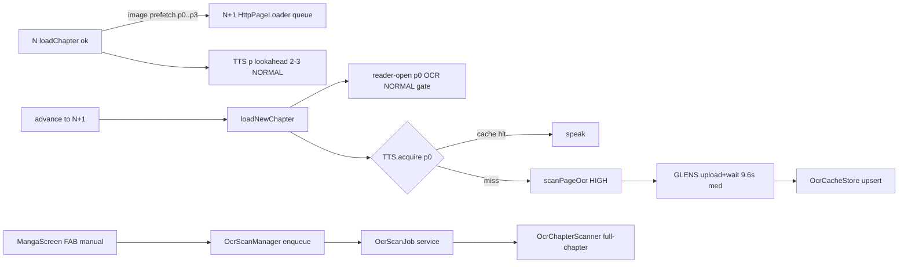
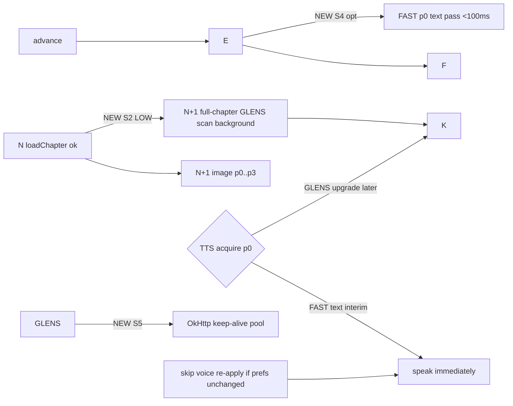

# Yomitsu OCR, Prefetch & Latency System Audit

Date: 2026-09-25. Read-only code audit; zero source changes.
Scope: end-to-end path reader open → chapter N → N+1 transition → page image load → OCR scan → cache → TTS cold start → speech dispatch, plus dual-engine topology, prefetch boundaries, queue priorities, and the manual "Scan Next Chapter" FAB.

Evidence basis: source inspection (files/lines cited below) + device-verified numbers from prior sessions recorded in `docs/memory.md` (Stage 4M ch8475 GLENS medians; Stage 4L device PASS; Stage 2D TTS init measurements; 09-21 prefetch logcat capture). No new device session performed in this audit.

---

## 1. Executive summary & root-cause matrix

The system already has most of the machinery for fast chapter transitions:
per-chapter `HttpPageLoader` queues, next-chapter image prefetch (p0..p3),
reader-open OCR prefetch, a bounded prioritized OCR task queue, a disk
OCR cache with per-model predicates, and an eager TTS engine init. The
residual latency on a cold, uncached N→N+1 transition is dominated by
**one thing that is not addressable client-side: GLENS service latency**
(post-upload wait median ≈9.6s, p90 ≈17.9s, Stage 4M ch8475). Everything
else on the transition path is already under ~1s in the common case.

Root-cause matrix (measured or traced, not guessed):

| # | Symptom | Root cause | Evidence |
|---|---|---|---|
| RC-1 | N+1 first-page OCR wait 10–20s on uncached transition | GLENS post-upload service wait (remote), not client work | Stage 4M: upload med 3ms/p90 4.9s; post-upload wait med 9.6s/p90 17.9s. `GlensOcrEngine.executeRequest` GlensOcrEngine.kt:359-417 |
| RC-2 | Uncached N+1 page-list fetch blocks reader open ~300ms | One cold `getPageList` round-trip when `ChapterCache` page-list entry absent (fresh chapter, cleared cache) | `HttpPageLoader.getPages` HttpPageLoader.kt:71-84; 09-21 logcat: 302+302+200 ≈334ms |
| RC-3 | p0 HIGH OCR scan waits ~0.615s behind prefetch slots | `PrioritizedTaskQueue` cap 3, TTS prefetch depth 2–3 fills all slots; HIGH enqueues after NORMALs already running (running tasks not preempted) | PrioritizedTaskQueue.kt:121-134 (drain only when `activeTasks < maxConcurrentTasks`); Stage 4P measured 0.615s |
| RC-4 | First TTS speech after cold start ≈5.4s | Google TTS `onInit` service latency, irreducible client-side; mitigated (not eliminated) by Stage 2D eager init: reader open fires `ttsEngine.initialize()` before user taps play → cold 5381ms → warm 81ms reuse | AndroidTtsEngine.kt:54-126; Stage 4N split (awaitMs=5381 + voicecfg 305ms) |
| RC-5 | ~250–300ms re-apply overhead on every TTS resume/reuse | `initialize()` re-applies full voice config (`voices`/`engines` enumeration + `setVoice`) on the fast path when engine already exists | AndroidTtsEngine.kt:55-59 + 223-292 (voicesMs/enginesMs ~100-300ms combined, Stage 4N) |
| RC-6 | FAST local engine effectively dead on the scan path | `detectionEngine()` is `UnavailableDetOcrEngine` (throws `DetectionUnavailable`), so `scanLocalOrFallback` always redirects to GLENS; local model assets (`ocr_fast/*.tflite`) are gitignored and absent on fresh clones → even a direct FAST selection throws at `Environment`/asset load | OcrRepositoryImpl.kt:155-161, 350-382; DetOcrEngine.kt:13-16; AGENTS.md ML-model gotcha |
| RC-7 | Manual FAB (scan next chapter) is user-gated, so N+1 OCR on chapter entry depends on user action | `MangaScreenModel.scanNextUnreadChapter()` (MangaScreenModel.kt:803-809) enqueues via `OcrScanManager` → `OcrScanJob` service; no reader-entry hook triggers it. Reader-open prefetch covers only p0 of the ACTIVE chapter, not N+1 | ReaderViewModel.kt:639 (`maybePrefetchReaderOpenOcr(0)` in `loadNewChapter`); `NextChapterPrefetchGate` covers images only, not OCR |
| RC-8 | TTS can speak p0 only after GLENS p0 returns (single-stage) | No local first-pass exists: `scanPageOcr` → `OcrRepositoryImpl.scanPage` → engine chain is GLENS-first; FAST is fallback-only and unreachable per RC-6 | OcrRepositoryImpl.kt:268-304 (`dispatchScan`), TtsPlaybackController.kt:538-563 (`acquireSentences`) |

---

## 2. Step-by-step latency breakdown (N → N+1, uncached, TTS active)

Traced path with per-step current vs target numbers. "Current" values are
device-measured where a prior session measured them (marked M), otherwise
code-traced estimates (marked T).

| Step | What happens | File:line | Current | Target |
|---|---|---|---|---|
| 1 | User at end of N; TTS fires `AdvanceChapter` | TtsPlaybackController.kt:494-506 | — | — |
| 2 | `loadAdjacent(next)` → `loadChapter(N+1)` | ReaderViewModel.kt:652-679, 556-584 | T ~50ms (DB) | T ~50ms |
| 3 | N+1 page-list fetch (uncached) | HttpPageLoader.kt:71-84 | M 334ms (09-21 capture, 302×2+200) | ≤50ms when prefetched page-list; 0ms on cache hit |
| 4 | N+1 p0 image download | HttpPageLoader.kt:89-117, 177-214 | M 1–20ms (09-21: disk-cache hits because **next-chapter prefetch already ran** at step 2 via `maybePrefetchNextChapter` — see step 0) | 0–50ms (cache hit typical) |
| 0 (pre-2) | N+1 p0..p3 image prefetch fired at N's `loadChapter` success | ReaderViewModel.kt:582, 593-620; ChapterLoader.kt:83-93 | M fired (3× logcat 09-20, 09-21) | DONE — shipped |
| 4b | N+1 page-list prefetch | `loader.loadChapter(next)` inside prefetch job enqueues page-list fetch of N+1 on N+1's own loader | M covered by same prefetch job | DONE |
| 5 | `loadNewChapter` → `maybePrefetchReaderOpenOcr(0)` — NORMAL-priority p0 OCR scan started early | ReaderViewModel.kt:626-647, 415-430 | M 0.615s queue wait (Stage 4P) | ≤0.1s if N's TTS not prefetching 3 slots |
| 6 | GLENS p0 scan: upload + service wait | GlensOcrEngine.kt:137-163, 359-417 | M med 9.6s / p90 17.9s service wait (Stage 4M) | irreducible client-side; ~1s if local engine answers first (see §5 Stage 1) |
| 7 | Result → `OcrCacheStore.upsert` | OcrRepositoryImpl.kt:454-467; OcrCacheStore.kt:31-61 | T 5–20ms | same |
| 8 | TTS `acquireSentences` p0: cache read → hit if step 7 done; else awaits scan | TtsPlaybackController.kt:552-563 | M 1625ms cached startup (BUG-004 era) vs 15870ms uncached | bounded by step 6 |
| 9 | TTS engine init on first speech | AndroidTtsEngine.kt:54-126 | M warm 81ms (Stage 2D eager init); cold 5381ms+305ms if eager init missed (Stage 4N) | 81ms |
| 10 | Voice config re-apply on reuse fast path | AndroidTtsEngine.kt:55-59 → 223-292 | M ~250–305ms (voicesMs+enginesMs+apply, Stage 4N) | ~5ms (skip when prefs unchanged) |
| 11 | `speak()` dispatch → first audio | AndroidTtsEngine.kt:128-153 | M tens of ms (system) | same |

Transition-total on uncached N+1 (current): **dominated by step 6 (~10–18s
median/p90) when the user starts read-aloud immediately**. With local-first
dual-stage (§5), steps 6→8 for p0 collapse to ~100ms and step 6 GLENS runs
in background to upgrade the cache.

### What the N→N+1 path looks like today (shipped prefetch in place)

```
N loadChapter success
   └─ maybePrefetchNextChapter ──► N+1 loader: page-list + p0..p3 images
                                   (isolated per-chapter queue; cellular-guard)
N advance (TTS or user)
   ├─ loadAdjacent(N+1) ─► loadChapter: page-list from cache (M ~ms)
   │                        p0 image from ChapterCache (M ~ms)
   ├─ loadNewChapter ─► maybePrefetchReaderOpenOcr(0)   [NORMAL, readerOpenPrefetchGate]
   └─ TTS: acquireSentences(p0)
          ├─ cache hit? ── yes ─► segment ─► speak
          └─ no ─► scanPageOcr HIGH ─► [queue: up to 0.615s wait if 3 slots busy]
                                       ─► GLENS upload + service wait (M 9.6s med / 17.9s p90)
                                       ─► OcrCacheStore.upsert ─► return
```

Reader-open OCR prefetch (step 5) was moved to `loadNewChapter` in Stage 4P
(ReaderViewModel.kt:639) specifically to start p0 scan before TTS start
waits on it. It does NOT cover N+1 — the one-shot `ReaderOpenPrefetchGate`
is keyed by active chapter id, and `maybePrefetchReaderOpenOcr` is skipped
while a TTS session is active (ReaderViewModel.kt:416-420), which is exactly
the auto-advance case.

---

## 3. OCR engine topology & fallback analysis

### 3.1 Engine selection (OcrRepositoryImpl.kt)

- Selection: `ocrModelPref` (`pref_ocr_model`, default `LEGACY`) →
  `selectedEngineType()` OcrRepositoryImpl.kt:92-99.
- `dispatchScan` OcrRepositoryImpl.kt:268-304:
  - `GLENS` → `scanWithGlens` (single retry on HTTP 5xx/429,
    OcrRepositoryImpl.kt:390-416).
  - `LEGACY`/`FAST` → `scanLocalOrFallback` (OcrRepositoryImpl.kt:350-382):
    local detection (`UnavailableDetOcrEngine`, throws `DetectionUnavailable`)
    → redirect to GLENS, gated by `pref_use_fallback_models`
    (OcrPreferences.kt:17, default true).
  - `OWOCR` → self-hosted server scan, fallback to GLENS
    (OcrRepositoryImpl.kt:513-544), gated by same pref.
- Fallback map `fallbackFor` OcrRepositoryImpl.kt:117-124:
  GLENS→FAST, FAST→GLENS, LEGACY→GLENS, OWOCR→GLENS. Note: FAST→GLENS is
  the *useful* direction today because FAST is dead (RC-6). GLENS→FAST is
  latent (only fires if `useFallbackModels` on AND FAST assets present AND
  GLENS hard-fails).
- `recognizeText` (manual crop path) OcrRepositoryImpl.kt:198-216:
  LEGACY/FAST selections redirect to GLENS outright (ponytail comment at
  :207 — drop when a real DetOcrEngine lands).

### 3.2 GlensOcrEngine (remote, primary)

- Tile geometry `tileTopsFor` GlensOcrEngine.kt:36-57: tall strips
  (`isTallStrip` :134-135, aspect >3:1 AND height >1500) tiled with
  `TILE_ASPECT_RATIO=1.8`, `MIN_TILE_HEIGHT=1000`, 20% overlap.
- `TILE_CONCURRENCY = 4` GlensOcrEngine.kt:1023 (Stage 4K shipped
  3→4, 09-19; device-verified 4L: 11-tile scan max 4 concurrent).
- Each tile = independent `HttpURLConnection` POST to
  `lensfrontend-pa.googleapis.com/v1/crupload` with
  `Connection: keep-alive` header set but **no connection pooling /
  keep-alive reuse** — `executeRequest` GlensOcrEngine.kt:359-417 opens a
  fresh `URL.openConnection()` per tile and `connection.disconnect()` in
  `finally` (:415). Per-tile handshakes are the p90 4.9s first-batch
  uploads (Stage 4M). No client-side retry on 502 in the scan path
  (known-issue WATCH, memory.md — only `isTransientHttpFailure` single
  retry at OcrRepositoryImpl.kt:385-416 for HTTP 5xx/429).
- `OcrEngineLocks` (OcrEngineLocks.kt:12-25): GLENS scans run **unlocked**
  (stateless client; tile-level parallelism inside one scan is enough).
  FAST/OWOCR keep mutexes (interpreter thread-safety).
- Dedup `dedupeOverlapping` GlensOcrEngine.kt:267-278: IoU ≥0.45 seam
  ceiling (known-issue #6).

### 3.3 FastOcrEngine (local, TFLite/LiteRT)

- Status: **packaged but unreachable on the scan path.**
  - Assets `ocr_fast/{encoder,decoder}.tflite` gitignored (AGENTS.md gotcha);
    present in dev containers/CI via pinned download step, absent on
    fresh clones.
  - `scanLocally` (OcrRepositoryImpl.kt:546-591) is crop-based
    recognition over *detected* boxes; `detectionEngine()` is the
    `UnavailableDetOcrEngine` stub (OcrRepositoryImpl.kt:155-161,
    DetOcrEngine.kt:13-16) → every local scan throws
    `DetectionUnavailable` → GLENS redirect. The ~60 lines of
    `scanLocally`/`cropBitmap` are documented debt (BUG-011 second half,
    "delete when a real DetOcrEngine lands").
  - `FastOcrEngine` itself (FastOcrEngine.kt) is a working
    encoder/decoder KV-cache pipeline: 224×224 input, 4-layer decoder,
    greedy decode, CPU threads clamped 2–4 (:148). It can run a full-page
    inference directly via `recognizeText(Bitmap)` — the dual-stage
    proposal (§5) would use exactly that entry point, bypassing the
    dead detection chain.
  - Known limitation (issue #1): local scan ordering = raw detection
    index; without a detection engine there are no regions, so a
    whole-page FAST pass yields one text blob with no bounding boxes →
    no region order. The hybrid proposal must treat FAST stage-1 output
    as *text only* (single region, order 0), which `SpeechPipeline`
    handles (one region → sentences split on terminal punctuation).

### 3.4 PrioritizedTaskQueue

- `maxConcurrentTasks = 3` (PrioritizedTaskQueue.kt:13-16). Tiers:
  HIGH/NORMAL only. No LOW tier (deferred, Phase-1 audit: N+1 OCR
  prefetch would need it; TTS reschedules on advance so it's tolerable).
- Drain semantics (PrioritizedTaskQueue.kt:121-161): worker takes HIGH
  then NORMAL; when `activeTasks >= 3` the worker parks and restarts on
  slot release. Running tasks are never preempted → a HIGH task enqueued
  while 3 NORMALs run waits for a slot (measured 0.615s, Stage 4P).
- TTS mapping: active-page on-demand scan = HIGH (reportFailure=true,
  TtsPlaybackController.kt:751); prefetch pages = NORMAL (reportFailure=
  false, :834, depth 2–3 by rate, :784-791); reader-open prefetch =
  NORMAL (:428 `prefetchReaderOpenPage`).
- Starvation check: HIGH is FIFO-ahead-of-NORMAL for *newly running*
  tasks; a long GLENS scan occupying a slot is network-bound and
  completes regardless. The 0.615s p0 wait is a measured slot-wait, not
  indefinite starvation. Bump cap 3→4 or add a preemption hook only if
  N+1 OCR prefetch ships (then LOW tier).

### 3.5 OcrCacheStore / OcrCacheDatabase

- Schema `ocr_cache.sq`: `ocr_pages` UNIQUE(chapter, page, ocr_model)
  ON CONFLICT REPLACE; `ocr_regions` cascade FK; index on
  (chapter_id, page_index, ocr_model) + regions by page.
- `getPage` predicate includes `ocr_model` (BUG-004 fixed 09-13, no
  migration needed — index already existed).
- Prune: 5000-page cap inside the upsert transaction
  (OcrCacheStore.kt:58, 63-69, 285). Schema-outdated check deletes DB if
  `ocr_regions.orientation` column missing (OcrCacheStore.kt:209-239).
- Read path in TTS: `getCachedPageOcr` → `OcrRepositoryImpl.getCachedPage`
  with *currently selected* model (OcrRepositoryImpl.kt:306-315) —
  model switch invalidates hits by construction.

---

## 4. TTS init & playback sync

- `AndroidTtsEngine.initialize()` AndroidTtsEngine.kt:54-126:
  - Cold: `TextToSpeech` ctor on Main + `readiness.await()`
    (onInit callback) = M 5381ms (Stage 4N, ch7877) — genuine Google
    TTS service latency, irreducible client-side; a 28.9s anomalous boot
    was observed once (E-family refuted: not app bug).
  - Warm: `existing != null` → `applyVoiceConfig(existing)` fast path
    = M 81ms reuse (Stage 2D: eager init fired 43s pre-tap at reader
    open).
  - `applyVoiceConfig` (AndroidTtsEngine.kt:223-292) enumerates
    `engine.voices` + `engine.engines` (66/227 entries observed) then
    `setVoice`/`setLanguage` — M 305ms on cold path, ~250ms on every
    warm re-apply. **Bug-class finding**: the warm path re-enumerates and
    re-applies even when prefs are unchanged; the only REDUCE seam
    (Stage 4N verdict) is skipping re-apply when
    (enginePackage, voiceName, languageTag) are unchanged — ~250ms/resume,
    not first-speech.
- `ReaderViewModel.init` fires `ttsEagerInitJob` (ReaderViewModel.kt:523-536)
  overlapping Google TTS startup with reader prep; idempotent
  fast-path dedups against later starts.
- `TtsPlaybackController` (TtsPlaybackController.kt):
  - phases Idle/Preparing/LoadingPage/Playing/Paused/Finished/Error;
    chapter rebind via `state.map { ... drop(1) }.onEach { onTtsChapterChanged() }`
    (ReaderViewModel.kt:353-357).
  - `acquireSentences` (TtsPlaybackController.kt:538-670): cache-first
    (`getCachedPageOcr`), then `scanOnDemand` (HIGH if reporting
    failures, NORMAL if prefetch — :751/:834), exclusion-zone matching,
    `SpeechPipeline.dedupeOverlappingDuplicates` +
    `toSpeakableSentences` (region order preserved by design — the
    segmenter never re-sorts; ordering belongs to the OCR engine).
  - `SentenceSegmenter` (SentenceSegmenter.kt): regions consumed in
    stored list order; terminal punctuation set `。！？!?‼⁇⁉⁈` +
    ASCII-dot-only-before-whitespace rule (keeps "..." and "3.14"
    intact, :51-57). Single-region FAST text → one sentence per terminal.
  - Prefetch: `schedulePrefetch` depth by rate (2 / 3 / 3 for
    <1.5×, ≥1.5×, ≥2.5× — :784-791), parallel `async` per page
    (:817-846), mid-page re-arm at ≥2× rate (:407-411). Prefetch scans
    are NORMAL; the active page HIGH can only lose slot contention, not
    correctness.
  - Chapter advance: `AdvanceChapter` → host `loadAdjacent` → TTS waits
    in `Preparing`; failure → `fail(ChapterLoadFailed)` (BUG-002 fixed).

---

## 5. Proposed hybrid dual-stage pipeline (feasibility verdict)

**Feasible, with two hard constraints — and one of them is already
shipped-against.**

### Stage 1 (local FAST first-pass, <100ms) — CONDITIONALLY FEASIBLE

- Entry point exists: `FastOcrEngine.recognizeText(bitmap)`
  (FastOcrEngine.kt:249) is a full-page inference, no detection needed.
  It would produce one region-less text blob; wrap as
  `OcrPageResult(regions=[OcrRegion(order=0, text, full-page box,
  HORIZONTAL)])` and upsert with `ocrModel=FAST` — no schema change
  (ocr_model is a TEXT column).
- **Constraint A (shipped-against)**: local OCR engine reinstatement is in
  the REJECTED register (roadmap §F: "reverses shipped −133MB
  optimization") — that rejection was about *restoring the legacy
  local-only pipeline as the primary engine*. A FAST *first-pass text
  stage under GLENS* is a different architecture (GLENS remains primary
  and authoritative; FAST output is interim). It still packages
  `ocr_fast/*.tflite` back into release assets (the 09-12 `v0.5.4`
  release explicitly verified "legacy assets/ocr/ absent"), so it needs
  fresh user authorization as a scope decision, not silent implementation.
- **Constraint B (quality)**: FAST is a JP-vocab model
  (OcrRepositoryImpl.kt:203-207 comment: "JP-vocab models that garble
  arbitrary English crops into kana/kanji"). For English manga the
  stage-1 text will be poor; it still beats 10s of silence for TTS
  start, and stage-2 GLENS upsert (same ocr_model-prefixed cache key
  space but *different* model row) will not clobber it — the TTS cache
  read is model-pinned (OcrRepositoryImpl.kt:306-315), so FAST text and
  GLENS text coexist under different `ocr_model` values.
- **Speech continuity hazard**: speaking FAST text then GLENS text means
  the user hears degraded audio on p0 that "corrects" on later pages,
  and a mid-session cache upgrade cannot retro-re-speak. Acceptable only
  if stage-1 is restricted to **first page of a cold transition**,
  never mid-chapter.

### Stage 2 (background GLENS upgrade) — ALREADY ALMOST SHIPPED

- `scanWithGlens` result is already upserted into `OcrCacheStore`
  (OcrRepositoryImpl.kt:454-467) by every scan, including NORMAL-priority
  prefetch. The missing piece is *triggering* a GLENS scan of N+1 at
  reader open, which the reader-open prefetch currently skips while TTS
  is active (ReaderViewModel.kt:416-420). That skip is correct for the
  *active* chapter (TTS's own prefetch covers it) but leaves N+1
  uncovered during auto-advance — exactly the gap a low-priority
  N+1-OCR-prefetch (deferred LOW queue tier, Phase-1 audit) would close.

### What to do (deferred to roadmap §E — NOT authorized here)

1. `PrioritizedTaskQueue` +LOW tier (~15 lines, PrioritizedTaskQueue.kt:17-20, 31-32, 129-130).
2. `ReaderViewModel` N+1 OCR prefetch job next to `nextChapterPrefetchJob`
   (mirrors ReaderViewModel.kt:607-619), NORMAL/LOW priority,
   `NextChapterPrefetchGate`-style gate, cellular guard shared.
3. Optionally FAST first-pass for cold p0 (needs user scope decision
   per Constraint A + asset repackaging build-size check).

---

## 6. Image & OCR prefetch boundaries — verified

- **N+1 image prefetch**: `maybePrefetchNextChapter`
  (ReaderViewModel.kt:593-620) at N's `loadChapter` success (:582):
  - guards: `prefetchNextChapter` pref (default true), `nextChapter !=
    null`, source is `HttpSource` (local/downloaded no-op),
    **non-cellular** (`TRANSPORT_CELLULAR` capability check, :599-602 —
    ponytail ceiling noted 09-20: metered-capability API21+ available but
    cellular is the real data-cost case; WiFi-metered edge not guarded),
    one-shot `NextChapterPrefetchGate` per active chapter id.
  - job: `loader.loadChapter(next)` (page-list) +
    `loader.prefetchFirstPages(next)` (p0..p3,
    ChapterLoader.kt:83-93, `pageCount=4` default; each `loadPage`
    auto-enqueues ADJACENT preloads of p1..p4 via
    `HttpPageLoader.preloadNextPages`, HttpPageLoader.kt:102-106, 155-169).
  - isolation: N+1's own `HttpPageLoader` queue (per-chapter
    `PriorityBlockingQueue`, HttpPageLoader.kt:44, 48-63) → N's active
    loads/TTS never preempted in-thread; contention only at OkHttp
    per-host pool + `ChapterCache` per-image `flush()`
    (ChapterCache.kt:148-166).
  - cancel: `loadNewChapter` (:630) + `onCleared` (:361).
  - eviction: N+1 prefetch writing 4 images into the 100 MiB
    `DiskLruCache` (ChapterCache.kt:213) evicts ~5–10 oldest N images —
    safe, they're refetchable.
- **Metered guard**: `isActiveNetworkMetered`-equivalent check is the
  `TRANSPORT_CELLULAR` capability test above (code-reviewed 09-20/09-21;
  not live-exercisable on unlocked device — no root for network-class
  forcing). Local/downloaded chapters skip prefetch entirely
  (`prefetchFirstPages` no-op, ChapterLoader.kt:87).
- **OCR prefetch boundaries**: reader-open p0 only (one-shot gate,
  ReaderViewModel.kt:422); TTS lookahead p1..p3 (depth by rate,
  TtsPlaybackController.kt:784-791). No N+1 OCR prefetch — the gap §5.2
  names.

---

## 7. FAB automation (reader-entry hook)

- Manual flow today: `MangaScreen` FAB → `MangaScreenModel.scanNextUnreadChapter()`
  (MangaScreenModel.kt:803-809) → `OcrScanManager.enqueue([nextUnread])`
  (OcrScanManager.kt:51-74) → `OcrScanJob` (background service) →
  `OcrChapterScanner.scanChapter` (OcrChapterScanner.kt:32-192):
  clears chapter cache, resolves pages, per-page scan with 90s
  `withTimeoutOrNull` (OcrChapterScanner.kt:128-130, PAGE_SCAN_TIMEOUT
  :238), skip-and-continue on per-page failure (09-19 resilience work),
  progress via `onProgress` → `OcrScanManager` queue state →
  `MangaScreenModel.observeOcrQueue` (MangaScreenModel.kt:600-617)
  spinner state.
- **Exact architectural hook to automate**: the chapter-scanner service
  path is *service-wide*, not reader-bound — it runs in
  `OcrScanJob` regardless of reader state. Two clean options:
  1. **Reader-entry auto-enqueue (recommended, smallest)**: in
     `ReaderViewModel.loadNewChapter`/`loadAdjacent` success, after
     `maybePrefetchReaderOpenOcr(0)`, also enqueue N+1's id through
     `OcrScanManager.enqueue` when (a) TTS auto-next-chapter pref on,
     (b) next-unread chapter exists and is uncached
     (`getCachedChapterIds` check, OcrRepositoryImpl.kt:317-321),
     (c) same cellular/metered guard as image prefetch. This reuses the
     entire service path (progress UI, per-page resilience, network
     checks in OcrChapterScanner.kt:223-235) with ~15 lines in
     ReaderViewModel. The FAB stays as a manual override (queue is
     idempotent: `enqueue` dedupes by chapter id, OcrScanManager.kt:52-57).
  2. Full reader-entry replacement of the FAB (FAB hidden when
     auto-scan active): UI-surface work in
     `MangaScreen`/`ContinueTab` — larger, needs design pass; the
     user-visible "spinner while scanning" already comes from
     `observeOcrQueue`, so option 1 gives near-zero manual work without
     touching UI.
- **Near-zero buffering claim**: with image prefetch (shipped) +
  reader-open p0 OCR (shipped) + N+1 background chapter scan (option 1),
  the N+1 transition's critical path is only "GLENS p0 not yet done"
  when the user advances faster than the background scan; the scan is
  whole-chapter and per-page-resilient, so p1+ are almost always warm by
  the time TTS reaches them. Residual = GLENS service latency on p0
  (RC-1), which no client scheduling removes.

---

## 8. Actionable checklist

### SHOULD (candidate tasks, need authorization — none implemented here)

- [ ] **S1** `PrioritizedTaskQueue` LOW tier (+ `OcrScanPriority.LOW`
      mapping) — prerequisite for N+1 OCR prefetch without starving TTS.
      ~15 lines + enum + 1 test. (Phase-1 audit verdict: DEFERRED, no
      N+1 OCR prefetch without it.)
- [ ] **S2** N+1 background OCR prefetch at reader open (ReaderViewModel
      hook, §7 option 1), gated by TTS-auto-next-chapter + uncached-check
      + cellular guard. Depends on S1 (LOW priority) or ships NORMAL
      (acceptable: TTS reschedules on advance).
- [ ] **S3** `applyVoiceConfig` skip-on-unchanged-prefs
      (~250ms/resume; Stage 4N-identified seam). Not first-speech path —
      needs its own authorization.
- [ ] **S4** (scope decision) FAST first-pass text for cold p0 + asset
      repackaging (ocr_fast tflites into release). Rejected-register item
      (roadmap §F) — user must explicitly lift the rejection for this
      *new* architecture before any code.
- [ ] **S5** GLENS connection pooling: swap raw `HttpURLConnection`
      (GlensOcrEngine.kt:359-417) for the shared OkHttp instance already
      used across the app (libs.versions.toml has OkHttp 5.4.0) to get
      keep-alive reuse across tiles → kills the 4.9s first-batch
      handshake p90 (Stage 4M).

### SHOULD NOT

- [ ] No new OCR queue tiers beyond LOW (3 tiers max; complexity for no
      measured gain).
- [ ] No TTS audio caching (durable decision #2 — system latency tens of
      ms; rejected).
- [ ] No N+1 OCR prefetch *without* S1 or a rate cap: depth is bounded by
      "1 chapter ahead, p0..p3 images + full-chapter background scan" —
      deeper stacks duplicate what TTS lookahead already does.
- [ ] No preempting running GLENS scans for HIGH: network-bound,
      preemption wastes an upload; slot-wait (0.615s) is the cheaper fix.
- [ ] No auto-enqueue when TTS auto-next-chapter is off: scanning a
      chapter the user won't auto-advance to is pure data cost.
- [ ] Don't hand-edit `docs/history/session-logs.md` structure; append
      only. Don't touch `architecture.md`/`design.md`/`phase.md`/
      `implementation-roadmap.md` until this report is saved + shown
      (per task protocol).

---

## 9. Current vs proposed architecture

### Current (shipped, as of HEAD 8732ed49d)



### Proposed (S1+S2+S3+S4+S5 — nothing shipped)



---

## 10. File citation index

| Area | File:line |
|---|---|
| Engine selection/dispatch | data/src/main/java/mihon/data/ocr/OcrRepositoryImpl.kt:92-99, 268-304 |
| Local redirect (dead detection) | OcrRepositoryImpl.kt:155-161, 350-382; DetOcrEngine.kt:13-16 |
| GLENS tiles/concurrency/keep-alive gap | GlensOcrEngine.kt:134-201, 359-417, 1023 |
| FAST engine (full-page inference) | FastOcrEngine.kt:249-294, 296-416 |
| Queue cap/semantics | PrioritizedTaskQueue.kt:13-20, 121-161 |
| Cache upsert/get/prune | OcrCacheStore.kt:31-69, 71-131, 285 |
| Cache schema + model predicate | data/src/main/sqldelight-ocr/tachiyomi/data/ocr/ocr_cache.sq:1-57 |
| Page-list/image loading | HttpPageLoader.kt:71-84, 89-117, 155-169, 177-214 |
| N+1 image prefetch trigger | ReaderViewModel.kt:582, 593-620; ChapterLoader.kt:83-93 |
| Gates | ReaderOpenPrefetchGate.kt:8-16; NextChapterPrefetchGate.kt:8-16 |
| Reader-open OCR prefetch | ReaderViewModel.kt:415-430, 626-647, 734-775 |
| TTS controller acquire/prefetch | TtsPlaybackController.kt:538-670, 777-849, 494-506 |
| TTS engine init/voice config | AndroidTtsEngine.kt:54-126, 223-292 |
| Eager TTS init at reader open | ReaderViewModel.kt:523-536 |
| Segmenter order/punctuation | SentenceSegmenter.kt:26-57 |
| Chapter cache cap/flush | ChapterCache.kt:148-166, 213 |
| OCR resolver cache-first page list | OcrPageSourceResolver.kt:124-193, 195-335 |
| FAB enqueue/observe | MangaScreenModel.kt:803-809, 600-617; MangaScreen.kt:188 |
| Background scanner resilience | OcrChapterScanner.kt:32-192, 223-235, 238 |
| Scan manager queue dedupe | OcrScanManager.kt:51-74 |
| OCR prefs (fallback gate) | domain/src/main/java/mihon/domain/ocr/service/OcrPreferences.kt:17 |

*End of Stage 1 report.*
